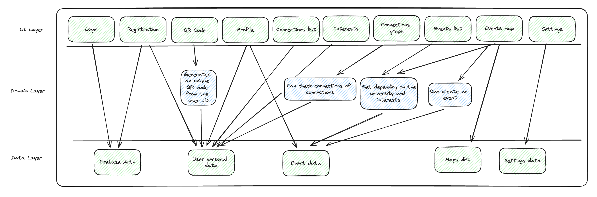

# Functional Requirements

*Max 3 pages.*

*List the key features of the MVP precisely.*

*Include appropriate architectural diagrams.*

*Describe key internal functionality.*

## Key Features of the MVP
1. User Authentication: Implements Google Auth for secure user authentication, enabling users to sign in with their Google accounts. This ensures a seamless and familiar login experience for users while maintaining robust security standards.

2. Profile Setup: Enables users to create and customize their profiles within the UniConnect application. Users can input personal information such as interests, academic pursuits, and profile pictures to personalize their profiles and enhance their visibility within the community.

3. Graph-Based Social Network Visualization: Develop a visual representation of users' social networks using graph-based visualization techniques. This feature allows users to explore their connections within the UniConnect platform, identifying friends of friends and potential acquaintances with ease.

4. Personalized Discovery: Implements algorithms to recommend connections based on shared interests, academic pursuits, and event participation. By analyzing user data, UniConnect provides personalized suggestions for connecting with like-minded peers, fostering genuine and meaningful connections.

5. Event Integration: Integrates with university events to provide users with information on upcoming events directly within the UniConnect application. Users can discover events relevant to their interests and see attendee lists, enabling them to connect with peers attending the same events.

6. Messaging System: Develop a messaging system within UniConnect to facilitate communication and collaboration among users. This feature allows users to send messages to their connections, fostering ongoing interaction and enabling collaboration on projects or discussions related to shared interests.

## Architectural diagram
The flow is not different from the PoC, every interaction happens between the front-end of the application and different services of the Firebase.

## Key Internal Functionality

Google Auth Integration:
Utilize Google Auth for secure user authentication and authorization, ensuring that only authorized users can access UniConnect. This integration also streamlines the login process for users, enhancing the overall user experience.

Firebase Integration:
Integrate Firebase Auth for user management and Firebase Realtime Database for storing user profiles, social network data, and messaging. This provides a scalable and reliable backend infrastructure for UniConnect, ensuring efficient data storage and retrieval.

Graph-Based Visualization:
Develop algorithms to generate and visualize users' social networks using graph-based visualization techniques. This internal functionality enables UniConnect to create an intuitive and interactive visualization of users' connections, enhancing user engagement and exploration.

Personalized Recommendations:
Implement recommendation algorithms to analyze user data and suggest relevant connections based on shared interests and event participation. This internal functionality enhances the user experience by providing personalized suggestions for connecting with peers who share similar interests and backgrounds.

Event Integration:
Integrate with university event data to provide users with information on upcoming events and facilitate event discovery and attendance. This internal functionality enables UniConnect to enrich the user experience by offering access to relevant and timely event information within the application.

Messaging System:
Develop a messaging system within UniConnect to enable users to communicate and collaborate with their connections. This internal functionality facilitates seamless communication between users, fostering ongoing interaction and collaboration within the UniConnect community.